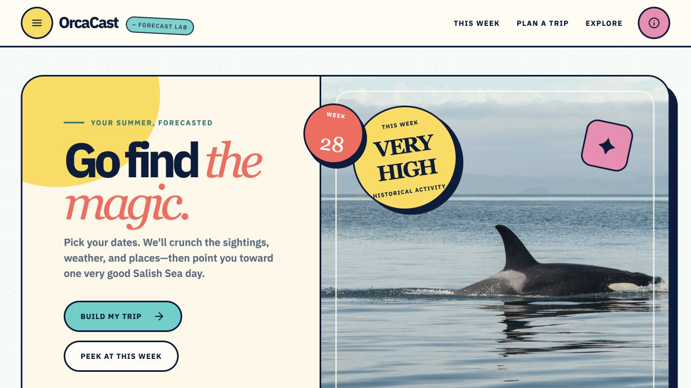
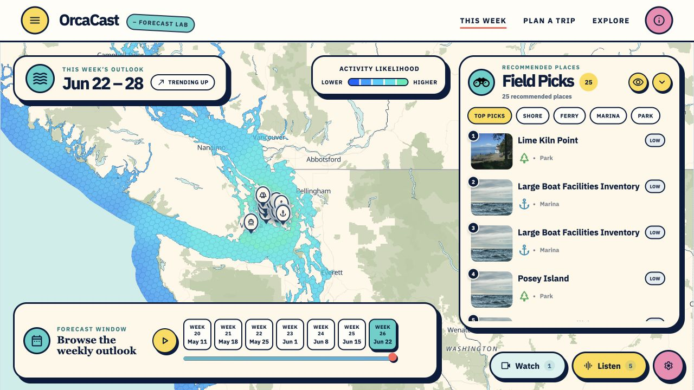
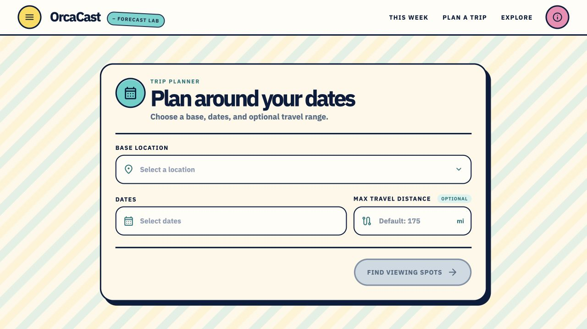
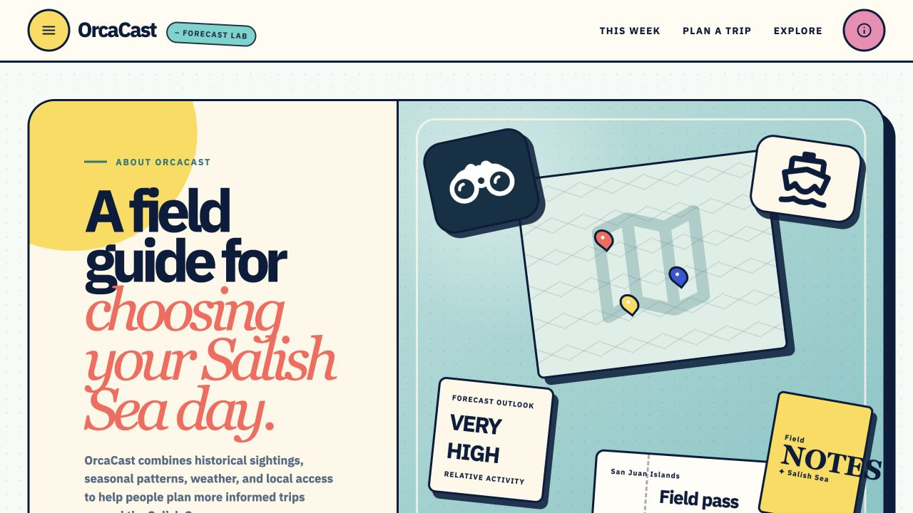
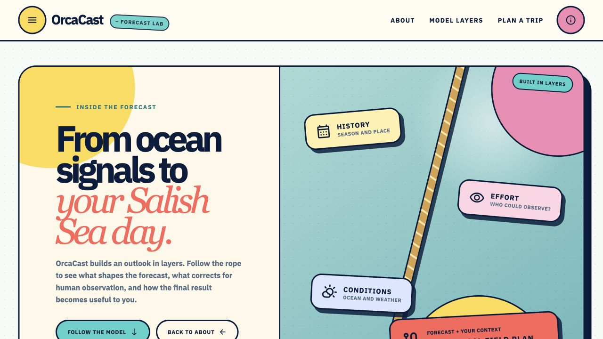

# OrcaCast

OrcaCast is a Salish Sea trip-planning and exploration application. It combines historical orca activity, forecast surfaces, weather, and local access information to help people choose dates and places for responsible, shore-first wildlife viewing.

The application is a React and TypeScript single-page app built with Vite. Its maps use MapLibre, H3 forecast grids, and locally packaged public data.

> OrcaCast provides relative activity guidance, not real-time whale tracking or a guarantee of a sighting. Always follow current wildlife, marine, park, and safety guidance.

## Application pages

### Home — `/`



The Home page introduces OrcaCast and gives visitors a quick seasonal pulse before they start planning. It highlights the current week's historical activity, shows a compact Friday Harbor weather outlook, summarizes typical sightings through the year, and routes visitors into the Planner or Watch experiences.

Key capabilities:

- Current-week historical activity summary
- Seasonal activity chart and short-range weather context
- Direct entry points to trip planning, forecast exploration, cameras, and hydrophones
- Responsible-use framing for the rest of the application

### Watch — `/watch`



The Watch page is the interactive forecast workspace. It overlays relative activity on the Salish Sea, provides a week-by-week timeline, and pairs the forecast with practical places where visitors can observe from shore, ferries, parks, or marinas.

Key capabilities:

- Interactive forecast map with activity legend, selectable color palettes, and hotspot controls
- Weekly forecast navigation and playback
- Ranked Field Picks with place details and map focus
- Park, marina, ferry, camera, and Orcasound hydrophone layers
- Itinerary building, reordering, map preview, and export
- Map reset, snapshot download, and sharing tools

### Planner — `/planner`



The Planner turns a visitor's dates, base location, and optional travel range into a more focused Salish Sea trip view. After a plan is submitted, it presents seasonal context, a mapped travel area, recommended viewing locations, and tools for assembling an itinerary.

Key capabilities:

- Base-location, arrival-date, departure-date, and travel-distance inputs
- Seasonal activity comparison for the selected travel window
- Forecast map constrained around the trip plan
- Recommended viewing spots with filters and detail views
- Camera and hydrophone discovery
- Persisted plan state and itinerary export

### About — `/about`



The About page explains how to interpret OrcaCast. It describes the signals used by the application, what the forecast can and cannot do, the geographic scope, data freshness, and responsible viewing principles.

Key capabilities:

- Plain-language overview of sightings, weather, seasonal patterns, and local access data
- Forecast workflow and interpretation guidance
- Clear limitations and uncertainty framing
- Responsible viewing guidance and links to official resources
- Current data and regional coverage context

### Model Methodology — `/about/model`



The Model Methodology page provides a deeper, visual walkthrough of the layers behind the forecast. It follows the model from seasonal history and recent activity through observer effort, spatial context, environmental proxies, uncertainty, and personalized viewing opportunity.

Key capabilities:

- Ten-stage explanation of the forecast and planning pipeline
- Status labels distinguishing current, integrating, and personalization layers
- Details on observer bias, spatial context, ecological proxies, and uncertainty
- Interpretation guidance for relative activity and viewing opportunity

## Local development

### Prerequisites

- Node.js 18 or newer (Node.js 20 recommended)
- npm

### Install and run

```bash
npm install
npm run dev
```

Vite prints the local development URL when the server starts. The app expects its runtime datasets and static assets under `public/`.

### Quality checks

```bash
npm run typecheck
npm run test
npm run lint
npm run build
```

Use `npm run build:check` to create a production build and check the bundle budget. Use `npm run repo:check` or `npm run data:validate` to validate packaged artifacts.

## Project structure

```text
src/
  app/                 Application shell and routing
  pages/               Home, Watch, Planner, About, and Model pages
  features/            Map, planner, watch, location, and analyst features
  shared/              Shared components, state, configuration, and data access
public/
  data/                 Forecasts, grids, activity, metadata, and locations
  images/               Static illustrations and icons
  spot-photos/          Viewing-location photography
docs/screenshots/       README page screenshots
scripts/                Build, test, and artifact-validation utilities
```

Important configuration lives in:

- `src/shared/config/appConfig.ts` for application and forecast defaults
- `src/shared/config/dataPaths.ts` for runtime data paths
- `src/shared/config/planner.ts` for planner behavior
- `vite.config.ts` for the frontend build

## Runtime data

The public application reads packaged datasets from `public/data`, including activity summaries, expected counts, forecasts, forecast grids, recent sightings, population context, periods, metadata, and places of interest. Keep temporal periods, H3 resolutions, model identifiers, and GeoJSON coordinate order consistent when refreshing these artifacts.

Forecast values should be interpreted as relative rankings across time and space. Reporting effort, access, weather, and sparse observations can all affect what is recorded and what can realistically be seen.

## Production deployment

```bash
npm run build
```

Deploy the generated `dist/` directory to a static host. Because OrcaCast uses client-side routing, configure the host to serve `index.html` as the fallback for routes such as `/watch`, `/planner`, and `/about/model`.

For Cloudflare Pages:

- Build command: `npm run build`
- Output directory: `dist`
- Node.js version: 18 or newer

### CI/CD deployment ownership

GitHub Actions validates, builds, deploys, and smoke-tests OrcaCast. The CI build uploads one
checksummed `production-dist` artifact; preview, staging, and production jobs download those same
bytes rather than rebuilding them. A failed production smoke test rolls Cloudflare Pages back to
the previously successful production deployment.

Before enabling deployment jobs:

1. Create `preview` and `production` GitHub environments.
2. Add `CLOUDFLARE_API_TOKEN` and `CLOUDFLARE_ACCOUNT_ID` secrets to both environments. Use a
   scoped token with Pages write access, not a global API key.
3. Add a repository variable named `PRODUCTION_URL` containing the canonical HTTPS origin.
4. Disable Cloudflare Pages automatic production and preview Git builds so they cannot bypass CI.
5. Enable the dependency graph, CodeQL, secret scanning, push protection, and validity checks.
6. Protect `main` and require the `ci`, dependency-review, CodeQL, and deployed-preview checks.

Browser-visible map keys are public configuration and must be restricted by domain, API, and quota
at their provider. Never place private credentials in a `VITE_` variable.
